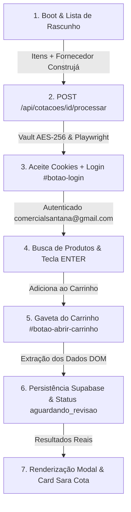

# Mapeamento Completo e Guia Definitivo de Replicação — Automação Construjá (RPA)

> **Sara Cota SaaS** — Guia oficial de arquitetura, fluxo de dados, seletores e automação em browser (Playwright RPA) para o fornecedor **Construjá** (`a1684c4d-d896-4ba9-a591-cda455c5ffe2`).

---

## 📌 Visão Geral do Fluxo End-to-End da Construjá

O processo de cotação automatizada para a Construjá segue uma sequência síncrona e estrita de passos no portal B2B (`https://www.construja.com.br/produtos`), garantindo que o robô nunca tente buscar produtos sem estar autenticado ou caia em URLs de erro 404.

---

## 🛠️ Detalhamento Passo a Passo das 6 Etapas OBRIGATÓRIAS

### 1️⃣ ETAPA "BOOT DA COTAÇÃO E LEITURA DA LISTA"
- **Onde ocorre**: Componente frontend [`CotacoesView.tsx`](file:///c:/Users/User/Desktop/Saracota/components/features/CotacoesView.tsx) e [`boot_cotacao_construja.tsx`](file:///c:/Users/User/Desktop/Saracota/Mapeamento_Saracota_Central/Mapeamento_Construja/01_boot_e_leitura_lista/boot_cotacao_construja.tsx).
- **Estrutura de Entrada**:
  - A lista de rascunho aceita qualquer termo enviado pelo usuário (digitação manual, voz ou colagem de itens).
  - O fornecedor **Construjá** é identificado e selecionado pelo ID fixo `a1684c4d-d896-4ba9-a591-cda455c5ffe2`.
- **Submissão**:
  - O frontend cria o registro da cotação e dispara a requisição HTTP `POST /api/cotacoes/[cotacaoId]/processar`.

---

### 2️⃣ ETAPA "AUTENTICAÇÃO NO FORNECEDOR CONSTRUJÁ"
- **Onde ocorre**: [`busca_credenciais_vault.ts`](file:///c:/Users/User/Desktop/Saracota/Mapeamento_Saracota_Central/Mapeamento_Construja/02_autenticacao_fornecedor/busca_credenciais_vault.ts) e [`login_construja_rpa.js`](file:///c:/Users/User/Desktop/Saracota/Mapeamento_Saracota_Central/Mapeamento_Construja/02_autenticacao_fornecedor/login_construja_rpa.js).
- **Ordem Estrita de Execução no Browser (Playwright)**:
  1. **Navegação Inicial**: O Playwright acessa `https://www.construja.com.br/produtos`.
  2. **Aceite de Cookies LGPD (Passo Crítico)**:
     - Seletor: `button:has-text("Aceitar"), button:has-text("Concordar"), button:has-text("Entendi"), #lgpd-aceitar`
     - **Regra**: Aceita o banner bloqueante de cookies para liberar o foco e a interatividade da página.
  3. **Abertura do Modal de Login**:
     - Seletor: `#botao-login`
     - Clica no gatilho de login no cabeçalho.
  4. **Preenchimento das Credenciais**:
     - E-mail (`selectors.email_input`): `input[name="email"].form-control`
     - Senha (`selectors.password_input`): `input#senha[name="senha"]`
  5. **Submissão do Formulário**:
     - Seletor: `button#btn-entrar`
     - Submete e aguarda 4000ms para a reidratação do estado da sessão B2B.

---

### 3️⃣ ETAPA "BUSCA DE PRODUTOS E ADIÇÃO AO CARRINHO"
- **Onde ocorre**: [`busca_e_matching_construja.js`](file:///c:/Users/User/Desktop/Saracota/Mapeamento_Saracota_Central/Mapeamento_Construja/03_busca_e_carrinho/busca_e_matching_construja.js).
- **Navegação de Pesquisa**:
  - A pesquisa é feita via URL direta:
    `https://www.construja.com.br/produtos?pagina=1&busca=${encodeURIComponent(termoSanitizado)}`
- **Validação Semântica**:
  - Valida se o título do produto no primeiro card (`.ProdutoCard_title__1Fm0w, a[href*="/produto/"]`) possui correlação com as palavras-chave do termo pedido.
- **Inclusão no Carrinho B2B**:
  - Preenche a quantidade pedida no campo `input.QuantidadeMaisMenos_input__grKxO`.
  - Pressiona a tecla **`Enter`** no próprio campo de quantidade para efetuar a adição instantânea ao carrinho sem depender de botões desabilitados.

---

### 4️⃣ ETAPA "LEITURA DA GAVETA DO CARRINHO"
- **Onde ocorre**: [`extracao_gaveta_carrinho_construja.js`](file:///c:/Users/User/Desktop/Saracota/Mapeamento_Saracota_Central/Mapeamento_Construja/04_leitura_carrinho/extracao_gaveta_carrinho_construja.js).
- **Abertura da Gaveta Slide-Over**:
  - Clica no botão `#botao-abrir-carrinho` presente no topo da página.
  - **REGRA CRÍTICA**: **NUNCA navegar para `/produtos/carrinho`** (essa rota retorna erro 404). A extração deve ocorrer diretamente no contexto do modal/drawer aberto na própria página.
- **Extração DOM**:
  - Containers dos itens: `.ProdutoCompactCarrinho_itemContainer__Eaq76`
  - Título do produto: `.ProdutoCompactCarrinho_productTitle__n7FXX`
  - Preço unitário: `.d-flex.flex-column > span.fs-14.fw-bold`
  - Quantidade: `input.QuantidadeMaisMenos_input__grKxO`
  - Total do pedido: `tr:has-text("Total pedido") td.text-end`

---

### 5️⃣ ETAPA "RETORNO E PERSISTÊNCIA DOS DADOS"
- **Onde ocorre**: [`payload_e_matching_engine_construja.ts`](file:///c:/Users/User/Desktop/Saracota/Mapeamento_Saracota_Central/Mapeamento_Construja/05_retorno_dados/payload_e_matching_engine_construja.ts).
- **Persistência**:
  - Os itens e preços extraídos são salvos em `itens_cotacao_fornecedor` via `db.cotacoes.salvarResultadosMatching`.
  - O status do progresso é atualizado para `aguardando_revisao` (100% concluído).

---

### 6️⃣ ETAPA "EXIBIÇÃO NO PAINEL SARA COTA"
- **Onde ocorre**: [`ModalDetalheConstruja.tsx`](file:///c:/Users/User/Desktop/Saracota/Mapeamento_Saracota_Central/Mapeamento_Construja/06_modal_resultado/ModalDetalheConstruja.tsx).
- Renderiza os itens cotados com preços reais formatados em BRL (`formatCurrencyBRL`), exibindo o subtotal por item e o valor total geral do fornecedor.

---

## 📋 Tabela Oficial de Seletores (Construjá)

| Ação / Elemento | Seletor CSS / Estratégia |
|---|---|
| **Aceite de Cookies** | `button:has-text("Aceitar"), button:has-text("Concordar"), #lgpd-aceitar` |
| **Gatilho de Login** | `#botao-login` |
| **Campo E-mail** | `input[name="email"].form-control` |
| **Campo Senha** | `input#senha[name="senha"]` |
| **Submeter Login** | `button#btn-entrar` |
| **URL de Busca** | `https://www.construja.com.br/produtos?pagina=1&busca={query}` |
| **Card / Título do Produto** | `.ProdutoCard_title__1Fm0w, a[href*="/produto/"]` |
| **Campo de Quantidade** | `input.QuantidadeMaisMenos_input__grKxO` |
| **Adição ao Carrinho** | Tecla `Enter` no campo de quantidade |
| **Abertura da Gaveta Carrinho** | `#botao-abrir-carrinho` |
| **Container de Item no Carrinho** | `.ProdutoCompactCarrinho_itemContainer__Eaq76` |
| **Título do Item no Carrinho** | `.ProdutoCompactCarrinho_productTitle__n7FXX` |
| **Preço Unitário no Carrinho** | `.d-flex.flex-column > span.fs-14.fw-bold` |
