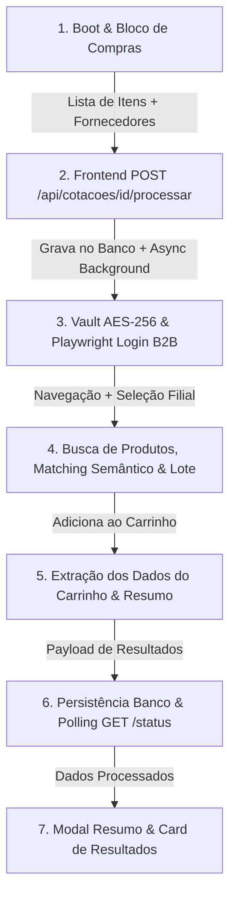

# Mapeamento Completo e Guia de Replicação — Automação de Cotação Cicalfer (RPA)

> **Sara Cota SaaS** — Guia oficial de arquitetura, fluxo de dados e automação de cotações para reutilização em novos fornecedores.

---

## 📌 Visão Geral do Fluxo End-to-End

O processo de cotação automatizada na Sara Cota integra a interface web (Next.js), o cofre de credenciais salvas (AES-256), a API de processamento assíncrono, o motor central de automação em browser (Playwright RPA), e a renderização interativa dos resultados.



---

## 🛠️ Detalhamento Passo a Passo das 7 Etapas

### 1️⃣ ETAPA "BOOT DA COTAÇÃO"
- **Onde ocorre**: Componente frontend [`CotacoesView.tsx`](file:///c:/Users/User/Desktop/Saracota/components/features/CotacoesView.tsx).
- **Como a lista é criada/carregada**:
  - O usuário insere itens no Bloco de Compras por digitação manual, comando de voz (`speechService`) ou colagem multilinha (`MultiItemPasteModal`).
  - Cada item possui a estrutura `ItemRascunho`:
    ```typescript
    interface ItemRascunho {
      id: string;
      texto: string;          // Ex: "10x Cabo Flexível 2.5mm Sil"
      quantidade: number;     // Ex: 10
      unidade?: string;       // Ex: "m" ou "un"
      origem: 'texto' | 'voz' | 'pdf';
      criadoEm: string;
    }
    ```
- **Seleção de fornecedores e botão "Cotar"**:
  - A interface lista os fornecedores cadastrados. A função `temAutomacaoRpaDisponivel` filtra fornecedores com RPA ativo (ex: `cicalfer`).
  - Ao clicar em **"Cotar Selecionados"**, o modal de seleção é fechado e o `handleConfirmEnviarCotacaoFornecedores` inicia a submissão.

---

### 2️⃣ ETAPA "LEITURA DA LISTA"
- **Onde ocorre**: Rota de API [`/api/cotacoes/[cotacaoId]/processar/route.ts`](file:///c:/Users/User/Desktop/Saracota/app/api/cotacoes/%5BcotacaoId%5D/processar/route.ts) e serviço [`matchingEngine.ts`](file:///c:/Users/User/Desktop/Saracota/lib/services/automacao/matchingEngine.ts).
- **Como a lista é enviada e lida**:
  - O frontend cria o registro da cotação no banco de dados e obtém o `cotacaoId`.
  - O frontend faz uma chamada HTTP `POST /api/cotacoes/[cotacaoId]/processar` contendo o payload:
    ```json
    {
      "itens": [
        { "id": "it-1", "texto": "Caixa d'Água 310L Fortlev", "quantidade": 2 }
      ],
      "fornecedorIds": ["33e03495-100d-45a3-9e34-899de56b0ab1"]
    }
    ```
  - A rota valida a existência da cotação, checa a trava de concorrência (`isCotacaoEmProcessamento`) e dispara `processarCotacaoTodosFornecedores` em background assíncrono.
  - No servidor, `processarCotacaoFornecedor` lê os itens recuperados via `db.cotacoes.getById(cotacaoId)`.

---

### 3️⃣ ETAPA "AUTENTICAÇÃO NO FORNECEDOR"
- **Onde ocorre**: [`matchingEngine.ts`](file:///c:/Users/User/Desktop/Saracota/lib/services/automacao/matchingEngine.ts), [`vault.ts`](file:///c:/Users/User/Desktop/Saracota/lib/security/vault.ts) e [`supplier-quote-engine/index.js`](file:///c:/Users/User/Desktop/Saracota/core/services/supplier-quote-engine/index.js).
- **Busca e descriptografia das credenciais**:
  - O backend recupera o registro do fornecedor no banco (`db.fornecedores.getById`).
  - Obtém o e-mail/login e a senha criptografada em AES-256 (`rawSenhaCriptografada`).
  - O hash é descriptografado chamando `decryptAES256(rawPass)` do cofre de segurança (`lib/security/vault.ts`).
- **Execução do login no site externo (Cicalfer)**:
  - O Playwright abre uma instância do Chromium e navega até a URL do site (`https://cicalfer.com.br/`).
  - Fecha banners de cookies se visíveis (`selectors.cookie_accept`).
  - Clica no botão/gatilho de login (`selectors.login_trigger`).
  - Preenche os seletores `selectors.email_input` e `selectors.password_input` com as credenciais.
  - Submete o formulário (`selectors.login_submit`).
  - Trata o modal de seleção de filial B2B (`selectors.filial_cards`), selecionando a opção que contenha a palavra-chave **"ENTREGA"** e confirmando.

---

### 4️⃣ ETAPA "BUSCA E ADIÇÃO AO CARRINHO"
- **Onde ocorre**: Módulo Central [`core/services/supplier-quote-engine/index.js`](file:///c:/Users/User/Desktop/Saracota/core/services/supplier-quote-engine/index.js).
- **Navegação e Pesquisa**:
  - Para cada item da lista, o robô navega diretamente até a URL de busca:
    `https://cicalfer.com.br/produtos?pagina=1&busca=${encodeURIComponent(termoBuscado)}`
  - O termo de busca é sanitizado (remoção de prefixos como `10x`, `2uni`).
- **Validação de Correlação Semântica**:
  - A função `validarCorrelacaoSemantica` compara as palavras-chave do pedido do cliente com o título retornado no primeiro card do grid de busca. Se não houver correlação semântica, o produto não é adicionado de forma errada.
- **Regra de Lote por Proximidade**:
  - O robô lê o texto do card de produto buscando padrões como `VENDE DE X EM X` ou `EMB: X`.
  - A função `calcularQuantidadeProxima(Q, X)` calcula a quantidade mais próxima baseada no lote (calculando as distâncias para o lote inferior e superior).
- **Preenchimento e Adição**:
  - Preenche o campo de quantidade (`input.QuantidadeMaisMenos_input__grKxO` ou `input[type="number"]`).
  - Dispara eventos DOM (`input`, `change`, `blur`) para reativação do estado React da loja virtual.
  - Clica no botão **"Comprar" / "Adicionar"**.
  - Trata modais de confirmação de alteração de orçamento (`selectors.modal_confirm_alteration`) se aparecerem.

---

### 5️⃣ ETAPA "LEITURA DO CARRINHO"
- **Onde ocorre**: Função `extrairCarrinho` em [`core/services/supplier-quote-engine/index.js`](file:///c:/Users/User/Desktop/Saracota/core/services/supplier-quote-engine/index.js).
- **Acesso ao carrinho**:
  - O robô navega diretamente para `https://cicalfer.com.br/carrinho`.
- **Extração de Itens e Valores**:
  - O Playwright avalia o DOM na página do carrinho identificando cada container de produto (`div[class*="ProdutoCompactCarrinho_itemContainer"]`).
  - Para cada item extrai:
    - **Nome do Produto**: Objeto do seletor `.ProdutoCompactCarrinho_productTitle__n7FXX`.
    - **Preço Unitário**: Primeiro elemento `.fs-14.fw-bold`.
    - **Preço Total do Item**: Segundo elemento `.fs-14.fw-bold`.
    - **Quantidade**: Valor do `input[type="number"]` no container.
  - **Função `parsePrecoBR`**: Converte strings do tipo `"R$ 1.234,56"` em números float puros (`1234.56`).
- **Leitura do Resumo Geral do Pedido**:
  - Lê a tabela de resumo (`table.table-bordered`), capturando as linhas de `Total itens`, `Despesa acessória` e `Total pedido`.

---

### 6️⃣ ETAPA "RETORNO DOS DADOS PARA A SARACOTA"
- **Onde ocorre**: [`matchingEngine.ts`](file:///c:/Users/User/Desktop/Saracota/lib/services/automacao/matchingEngine.ts) e [`db/client.ts`](file:///c:/Users/User/Desktop/Saracota/lib/db/client.ts).
- **Mapeamento 1-para-1**:
  - O backend correlaciona os itens extraídos do carrinho com os itens originais do pedido por referência, título exato e pontuação de palavras-chave (`usedCartIndices`).
- **Persistência**:
  - Os resultados são salvos via `db.cotacoes.salvarResultadosMatching(cotacaoId, fornecedorId, itensProcessados)`.
  - Registra a cotação nas tabelas de histórico (`db.historico.salvar`) e cotações ativas (`db.cotacoesAtivas.upsert`).
- **Polling de Progresso**:
  - Durante o processamento, o frontend realiza requisições periódicas a `GET /api/cotacoes/[cotacaoId]/status` para atualizar a barra de progresso em tempo real.

---

### 7️⃣ ETAPA "MODAL DE RESULTADO"
- **Onde ocorre**: Componentes [`ModalDetalheFornecedor.tsx`](file:///c:/Users/User/Desktop/Saracota/components/features/ModalDetalheFornecedor.tsx) e [`CardFornecedor.tsx`](file:///c:/Users/User/Desktop/Saracota/components/features/CardFornecedor.tsx).
- **Recebimento e Cálculos**:
  - O frontend recebe a lista de fornecedores com seus respectivos itens cotados.
  - Para cada item: `subtotalItem = Number((precoUnitario * quantidade).toFixed(2))`.
  - Soma de todos os subtotais = `valorTotalGeral`.
  - Os valores numéricos são formatados na moeda brasileira usando `formatCurrencyBRL` (`R$ X.XXX,XX`).
- **Layout Exibido**:
  - **Cards de Topo**: Subtotal de Produtos e Total do Pedido com destaque visual.
  - **Tabela de Itens**: Colunas de *Nome do Produto (Extraído do Site)*, *Quantidade*, *Preço Unitário* e *Preço Total*.
  - **Ações**: Botão **"Prosseguir para o fornecedor"** (abre a URL do carrinho já autenticado `https://cicalfer.com.br/carrinho` em nova aba) e botão **"Salvar PDF"**.

---

## 📊 Matriz Comparativa: Partes Fixas (Sara Cota) vs. Partes Específicas (Cicalfer)

Esta tabela orienta o desenvolvedor sobre o que é padrão na arquitetura da Sara Cota e o que precisa ser ajustado ao adaptar o robô para outro fornecedor:

| Componente / Etapa | Partes Fixas (Padrão Sara Cota — Reutilizável) | Partes Específicas (Site Cicalfer — Altera por Fornecedor) |
| :--- | :--- | :--- |
| **1. Boot da Cotação** | Interface do Bloco de Compras, Parser de Texto Multilinha, Reconhecimento de Voz, Estado `ItemRascunho[]`. | O ID/slug do fornecedor (`cicalfer`) e lógica `temAutomacaoRpaDisponivel`. |
| **2. Leitura da Lista** | Rotas de API `/api/cotacoes/[id]/processar`, Trava de Concorrência, Estrutura do objeto Cotação no Banco. | Nenhuma (100% reutilizável). |
| **3. Autenticação** | Banco de dados de Fornecedores, Cofre AES-256 (`vault.ts`), Descriptografia da senha, Instanciação do Playwright. | URL do site (`https://cicalfer.com.br/`), Seletores do modal de login, Seletores de filial ("ENTREGA"). |
| **4. Busca e Carrinho** | Algoritmo de Matching Semântico, Regra de Proximidade de Lote (`calcularQuantidadeProxima`), Retry & Error Handling. | URL de busca (`.../produtos?pagina=1&busca=...`), Seletores do input de busca, input de quantidade, botão comprar. |
| **5. Leitura do Carrinho** | Função de conversão monetária `parsePrecoBR`, Estrutura do objeto de retorno de produtos. | URL do carrinho (`/carrinho`), Seletores do container do item (`.ProdutoCompactCarrinho_itemContainer`), Seletores de preço (`.fs-14.fw-bold`). |
| **6. Retorno dos Dados** | Endpoint de polling `/api/cotacoes/[id]/status`, Salvação no Supabase/Banco (`cotacoes_matching`, `historico`). | Estrutura HTML do resumo de impostos/despesas específicas da loja. |
| **7. Modal de Resultado** | Layout React `ModalDetalheFornecedor`, Formatação `formatCurrencyBRL`, Exportação PDF, Redirecionamento ao carrinho. | URL final do carrinho direto do fornecedor. |

---

## 📁 Estrutura dos Arquivos Extraídos

Todos os trechos de código e configurações originais estão organizados nas seguintes subpastas:
- [`/01_boot_e_leitura_lista`](file:///c:/Users/User/Desktop/Saracota/Mapeamento_Saracota_Central/01_boot_e_leitura_lista)
- [`/02_autenticacao_fornecedor`](file:///c:/Users/User/Desktop/Saracota/Mapeamento_Saracota_Central/02_autenticacao_fornecedor)
- [`/03_busca_e_carrinho`](file:///c:/Users/User/Desktop/Saracota/Mapeamento_Saracota_Central/03_busca_e_carrinho)
- [`/04_leitura_carrinho`](file:///c:/Users/User/Desktop/Saracota/Mapeamento_Saracota_Central/04_leitura_carrinho)
- [`/05_retorno_dados`](file:///c:/Users/User/Desktop/Saracota/Mapeamento_Saracota_Central/05_retorno_dados)
- [`/06_modal_resultado`](file:///c:/Users/User/Desktop/Saracota/Mapeamento_Saracota_Central/06_modal_resultado)
