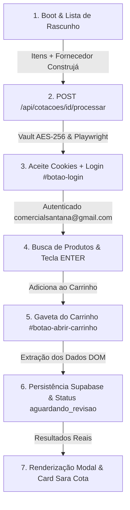

# Mapeamento Completo e Guia Definitivo de Replicação — Automação Construjá (RPA)

> **Sara Cota SaaS** — Guia oficial de arquitetura, fluxo de dados, seletores e automação em browser (Playwright RPA) para o fornecedor **Construjá** (`a1684c4d-d896-4ba9-a591-cda455c5ffe2`).

---

## 📌 Visão Geral do Fluxo End-to-End da Construjá

O processo de cotação automatizada para a Construjá segue uma sequência síncrona e estrita de passos no portal B2B (`https://www.construja.com.br/produtos`), garantindo que o robô nunca tente buscar produtos sem estar autenticado ou caia em URLs de erro 404.

---

## 🛠️ Detalhamento Passo a Passo das 6 Etapas OBRIGATÓRIAS

### 1️⃣ ETAPA "BOOT DA COTAÇÃO E LEITURA DA LISTA"
- **Onde ocorre**: Componente frontend [`CotacoesView.tsx`](file:///c:/Users/User/Desktop/Saracota/components/features/CotacoesView.tsx) e [`boot_cotacao_construja.tsx`](file:///c:/Users/User/Desktop/Saracota/Mapeamento_Saracota_Central/Mapeamento_Construja/01_boot_e_leitura_lista/boot_cotacao_construja.tsx).
- **Estrutura de Entrada**:
  - A lista de rascunho aceita qualquer termo enviado pelo usuário.
  - O fornecedor **Construjá** é identificado e selecionado pelo ID fixo `a1684c4d-d896-4ba9-a591-cda455c5ffe2`.

---

### 2️⃣ ETAPA "AUTENTICAÇÃO NO FORNECEDOR CONSTRUJÁ"
- **Onde ocorre**: [`busca_credenciais_vault.ts`](file:///c:/Users/User/Desktop/Saracota/Mapeamento_Saracota_Central/Mapeamento_Construja/02_autenticacao_fornecedor/busca_credenciais_vault.ts) e [`login_construja_rpa.js`](file:///c:/Users/User/Desktop/Saracota/Mapeamento_Saracota_Central/Mapeamento_Construja/02_autenticacao_fornecedor/login_construja_rpa.js).
- **Ordem Estrita de Execução no Browser (Playwright)**:
  1. **Navegação Inicial**: O Playwright acessa `https://www.construja.com.br/produtos`.
  2. **Aceite de Cookies LGPD (Passo Crítico)**:
     - Seletor: `button:has-text("Aceitar"), button:has-text("Concordar"), button:has-text("Entendi"), #lgpd-aceitar`
  3. **Abertura do Modal de Login**:
     - Seletor: `#botao-login`
  4. **Preenchimento das Credenciais**:
     - E-mail: `input[name="email"].form-control`
     - Senha: `input#senha[name="senha"]`
  5. **Submissão do Formulário**:
     - Seletor: `button#btn-entrar`

---

### 3️⃣ ETAPA "BUSCA DE PRODUTOS E ADIÇÃO AO CARRINHO"
- **Onde ocorre**: [`busca_e_matching_construja.js`](file:///c:/Users/User/Desktop/Saracota/Mapeamento_Saracota_Central/Mapeamento_Construja/03_busca_e_carrinho/busca_e_matching_construja.js).
- **Inclusão no Carrinho B2B**:
  - Preenche a quantidade pedida no campo `input.QuantidadeMaisMenos_input__grKxO`.
  - Pressiona a tecla **`Enter`** no campo de quantidade.

---

### 4️⃣ ETAPA "LEITURA DA GAVETA DO CARRINHO"
- **Onde ocorre**: [`extracao_gaveta_carrinho_construja.js`](file:///c:/Users/User/Desktop/Saracota/Mapeamento_Saracota_Central/Mapeamento_Construja/04_leitura_carrinho/extracao_gaveta_carrinho_construja.js).
- **Abertura da Gaveta**: `#botao-abrir-carrinho` (na própria página de produtos).
- **Extração DOM**:
  - Containers: `.ProdutoCompactCarrinho_itemContainer__Eaq76`
  - Título: `.ProdutoCompactCarrinho_productTitle__n7FXX`
  - Preço unitário: `.d-flex.flex-column > span.fs-14.fw-bold`
  - Quantidade: `input.QuantidadeMaisMenos_input__grKxO`

---

### 5️⃣ ETAPA "RETORNO E PERSISTÊNCIA DOS DADOS"
- **Onde ocorre**: [`payload_e_matching_engine_construja.ts`](file:///c:/Users/User/Desktop/Saracota/Mapeamento_Saracota_Central/Mapeamento_Construja/05_retorno_dados/payload_e_matching_engine_construja.ts).

---

### 6️⃣ ETAPA "EXIBIÇÃO NO PAINEL SARA COTA"
- **Onde ocorre**: [`ModalDetalheConstruja.tsx`](file:///c:/Users/User/Desktop/Saracota/Mapeamento_Saracota_Central/Mapeamento_Construja/06_modal_resultado/ModalDetalheConstruja.tsx).
