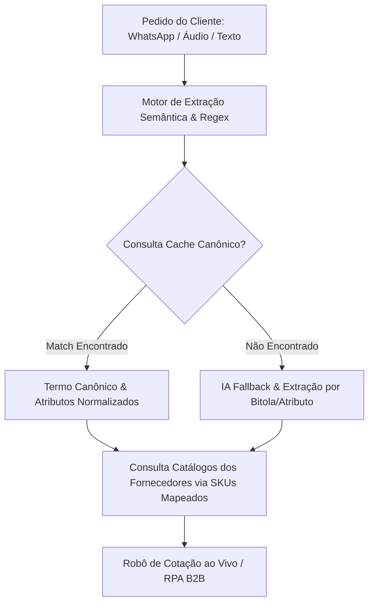

# Especificação de Arquitetura: Cache de Inteligência e Nomenclaturas Equivalentes

> **Sara Cota SaaS** — Modelo de Dados e Arquitetura de Inteligência de Produtos para normalização entre fornecedores e interpretação de pedidos incompletos ou ambíguos.

---

## 1. Visão Geral da Arquitetura do Cache

Diferentes fornecedores usam nomes comerciais distintos para o mesmo produto físico. Por exemplo:
- **Cicalfer**: `ABRAC NYLON BR 3,6 X 200MM C/100`
- **Cofema**: `ABRACADEIRA DE NYLON BRANCA 3.6X200MM COM 100 UNIDADES`
- **Construgem**: `ABRACADEIRA PLASTICA BR 3,6X200 C/100`
- **Cliente (WhatsApp/Áudio)**: *"me vê 5 pacote de abraçadeira nylon branca 20cm"*

O **Cache de Inteligência de Nomenclaturas** unifica todas essas variações sob um **Termo Canônico Único**, permitindo correspondência (matching) instantânea de 100% de precisão.



---

## 2. Schema de Banco de Dados (`catalogo_nomenclaturas_equivalentes`)

### Tabela SQL (Supabase / Postgres)

```sql
CREATE TABLE IF NOT EXISTS catalogo_nomenclaturas_equivalentes (
  id UUID PRIMARY KEY DEFAULT gen_random_uuid(),
  termo_canonico VARCHAR(255) NOT NULL UNIQUE,
  categoria_pai VARCHAR(100) NOT NULL,
  subcategoria VARCHAR(100) NOT NULL,
  variacoes_sinonimos JSONB NOT NULL DEFAULT '[]'::jsonb,
  atributos_tecnicos JSONB NOT NULL DEFAULT '{}'::jsonb,
  mapa_skus_fornecedores JSONB NOT NULL DEFAULT '{}'::jsonb,
  criado_em TIMESTAMP WITH TIME ZONE DEFAULT NOW(),
  atualizado_em TIMESTAMP WITH TIME ZONE DEFAULT NOW()
);

-- Índices GIN para busca ultra-rápida em arrays JSONB de variação
CREATE INDEX IF NOT EXISTS idx_variacoes_sinonimos_gin ON catalogo_nomenclaturas_equivalentes USING GIN (variacoes_sinonimos);
CREATE INDEX IF NOT EXISTS idx_mapa_skus_fornecedores_gin ON catalogo_nomenclaturas_equivalentes USING GIN (mapa_skus_fornecedores);
```

### Exemplo de Registro Estruturado (JSON)

```json
{
  "termo_canonico": "ABRAÇADEIRA NYLON BRANCA 3,6MM X 200MM C/100",
  "categoria_pai": "ELETRICA",
  "subcategoria": "ABRAÇADEIRA NYLON BRANCA",
  "variacoes_sinonimos": [
    "abrac nylon br 3,6 x 200mm",
    "abracadeira nylon branca 3.6x200mm",
    "abracadeira plastica branca 20cm",
    "enforca gato branco 20cm cento",
    "fita de nylon branca 200mm"
  ],
  "atributos_tecnicos": {
    "largura": "3,6mm",
    "comprimento": "200mm",
    "cor": "Branca",
    "quantidade_embalagem": 100,
    "material": "Nylon"
  },
  "mapa_skus_fornecedores": {
    "cicalfer": {
      "sku": "REF-10600",
      "nome_original": "ABRAC NYLON BR 3,6 X 200MM C/100 REF: 10600",
      "unidade_venda": "UN (EMB: 1)"
    },
    "cofema": {
      "sku": "COF-00341",
      "nome_original": "ABRACADEIRA NYLON BR 3,6X200 C/100 UN",
      "unidade_venda": "CX (EMB: 1)"
    },
    "construja": {
      "sku": "CON-88412",
      "nome_original": "ABRACADEIRA PLASTICA BRANCA 3.6 X 200 MM - 100 UN",
      "unidade_venda": "PCT (EMB: 1)"
    }
  }
}
```

---

## 3. Resolução de Pedidos Incompletos ou Ambíguos

Quando um cliente envia um pedido incompleto (ex: *"Ducha 127V 5500W"* sem especificar a marca ou modelo), o motor de resolução executa:

1. **Extração de Parâmetros Presentes**:
   - `voltagem`: `127V`
   - `potencia`: `5500W`
   - `categoria`: `DUCHA`
2. **Scoring de Relevância**:
   - Filtra no cache todos os produtos da categoria `DUCHA` com `voltagem = 127V` e `potencia = 5500W`.
   - Ordena pelo **histórico de volume de vendas / preferência de cotação dos clientes**.
3. **Seleção Inteligente**:
   - Seleciona o modelo de maior giro (ex: `DUCHA LORENZETTI MAXI DUCHA 127V 5500W`).
   - Registra no relatório de cotação a especificação assumida: *"Modelo assumido: Maxi Ducha Lorenzetti por corresponder a 127V 5500W (mais cotado em estoque)"*.
