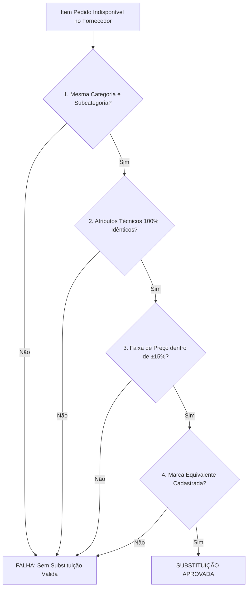

# Especificação de Arquitetura: Motor de Substituição Automática de Produtos

> **Sara Cota SaaS** — Regras de Negócio, Algoritmo de Equivalência e Estrutura de Registros para Substituição Automática de Produtos Indisponíveis.

---

## 1. Visão Geral do Motor de Substituição

Quando um cliente solicita um item específico (ex: *"Conduíte Corrugado Tigre 3/4 50m"*) e o fornecedor cotado não possui a marca exata em estoque ou a descontinuou, o **Motor de Substituição Automática** encontra e sugere o produto equivalente direto (ex: *"Conduíte Corrugado Krona 3/4 50m"*), garantindo que o orçamento não seja perdido por falta de um item em um fornecedor.

### Características Principais:
- **Ativo por Padrão** (pode ser desativado por cliente através da flag `substituicao_automatica_ativa`).
- **Transparência Total**: Qualquer substituição é sinalizada no relatório final enviado ao cliente com a justificativa técnica.
- **Tolerância de Preço**: Limita variações de preço para evitar substituir por itens de padrão muito superior ou inferior.

---

## 2. Regras de Avaliação e Filtro de Candidatos (5 Critérios)



### Detalhamento dos Critérios:

1. **Critério 1 — Categoria e Subcategoria**:
   O produto substituto candidato DEVE pertencer exatamente à mesma `categoria_pai` e `subcategoria`. (Ex: `ELETRICA > CABO FLEXÍVEL 2,50MM`).
2. **Critério 2 — Equivalência Técnica Estrita (100%)**:
   Todas as dimensões e bitolas essenciais DEVEM ser idênticas.
   - Bitola: `2,50mm` ↔ `2,50mm` (Rejeita `4,00mm` ou `1,50mm`)
   - Diâmetro: `25mm (3/4")` ↔ `25mm (3/4")`
   - Voltagem/Potência: `127V 5500W` ↔ `127V 5500W`
3. **Critério 3 — Tolerância de Preço (`±15%`)**:
   O preço unitário do item substituto deve estar na faixa de `0.85 * precoReferencia` a `1.15 * precoReferencia`.
4. **Critério 4 — Hierarquia de Marcas Equivalentes**:
   - Nível 1 (Marcas Premium): Tigre, Amanco, Krona, Fortlev, Lorenzetti, Cobercom, Cobrecom, Sil, Prysmian, Tramontina.
   - Nível 2 (Marcas Standard): JNG, Steck, Roma, Atlas, MTX.
   - A substituição ocorre preferencialmente entre marcas da mesma camada hierárquica.
5. **Critério 5 — Conversão de Unidade de Venda**:
   Garantir ajuste da quantidade solicitada para manter a metragem ou quantidade total correta (ex: rolo 100m vs rolo 50m).

---

## 3. Estrutura do Registro de Substituição no Banco de Dados

### Tabela `itens_cotacao_substituidos`

```sql
CREATE TABLE IF NOT EXISTS itens_cotacao_substituidos (
  id UUID PRIMARY KEY DEFAULT gen_random_uuid(),
  cotacao_id UUID NOT NULL REFERENCES cotacoes(id) ON DELETE CASCADE,
  item_original_solicitado VARCHAR(255) NOT NULL,
  sku_original VARCHAR(100),
  item_substituto_aplicado VARCHAR(255) NOT NULL,
  sku_substituto VARCHAR(100) NOT NULL,
  fornecedor_id UUID NOT NULL REFERENCES fornecedores(id),
  motivo_substituicao VARCHAR(100) NOT NULL, -- 'MARCA_INDISPONIVEL', 'LOTE_INCOMPATIVEL', 'DESCONTINUADO'
  justificativa_relatorio TEXT NOT NULL,
  preco_original_estimado DECIMAL(10, 4),
  preco_substituto_real DECIMAL(10, 4) NOT NULL,
  variacao_preco_percentual DECIMAL(5, 2) NOT NULL,
  criado_em TIMESTAMP WITH TIME ZONE DEFAULT NOW()
);
```

### Exemplo de JSON retornado no Relatório Final do Pedido

```json
{
  "itemSolicitado": "Conduíte Corrugado 3/4 Tigre (Rolo 50m)",
  "status": "SUBSTITUIDO",
  "itemSubstituto": {
    "sku": "REF-14502",
    "nome": "Conduíte Corrugado 3/4 Krona (Rolo 50m)",
    "marca": "Krona",
    "precoUnitario": 48.50,
    "unidadeVenda": "RL (EMB: 1)"
  },
  "motivo": "MARCA_INDISPONIVEL",
  "justificativa": "A marca solicitada 'Tigre' não está disponível no fornecedor Cicalfer. Foi aplicado o substituto equivalente 'Krona' com exatamente o mesmo diâmetro (3/4 - 25mm) e metragem (50m)."
}
```

---

## 4. Controle por Cliente (Toggle Flag)

Na tabela `clientes` (ou `configuracoes_cliente`):
- Coluna `substituicao_automatica_ativa`: `BOOLEAN DEFAULT TRUE`
- Quando `substituicao_automatica_ativa = FALSE`, o robô pula o motor de substituição e registra o item como `NAO_ENCONTRADO` caso a marca/modelo exato não exista.
