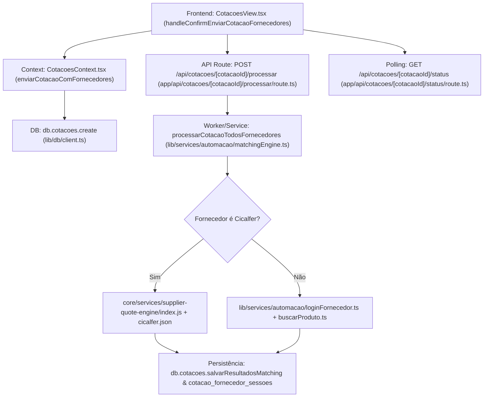

# Diagnóstico Completo do Fluxo "Disparar Cotação" — SaraCota SaaS

**Data do Diagnóstico:** 10/09/2026  
**Módulo:** SaraCota SaaS / Motor de Cotação Automática / RPA  
**Autor:** Antigravity AI  
**Arquivo de Origem:** `docs/historico/diagnostico-fluxo-cotacao-2026-09-10.md`  

---

## Executive Summary

Este documento apresenta uma investigação técnica aprofundada do fluxo de disparo de cotação do sistema **SaraCota**, rastreando toda a arquitetura do botão da interface até os trabalhadores de automação Playwright e persistência no banco de dados Supabase. Nenhuma alteração ou correção de código foi realizada nesta fase; o objetivo é mapear, diagnosticar e documentar integralmente o funcionamento atual, disparidades, gargalos e causas de falha.

---

## 1. Mapeamento do Botão "Disparar Cotação"

### A. Botões Existentes na Interface do Usuário

Na tela de cotações da aplicação (`components/features/CotacoesView.tsx`), existem **dois botões distintos** de disparo:

1. **Botão 1: "Cotar Cicalfer (Motor Central RPA)"**
   - **Localização:** [`components/features/CotacoesView.tsx:L1267-1276`](file:///c:/Users/User/Desktop/Saracota/components/features/CotacoesView.tsx#L1267-1276)
   - **Função Chamada:** `handleExecutarMotorCentralCicalfer`
   - **Comportamento:** Dispara uma requisição síncrona/direta `POST /api/v1/cotacoes/cotar-fornecedor` exclusiva para a Cicalfer.

2. **Botão 2: "Cotar com Fornecedores (X Cadastrados)"**
   - **Localização:** [`components/features/CotacoesView.tsx:L1278-1288`](file:///c:/Users/User/Desktop/Saracota/components/features/CotacoesView.tsx#L1278-1288)
   - **Função Chamada:** `handleOpenSelectSupplierModal` (Abre o modal "Selecionar Fornecedores para Cotação").
   - **Botão de Confirmação no Modal:** `"Cotar (X)"` (`handleConfirmEnviarCotacaoFornecedores`).
   - **Comportamento:** Cria a cotação no banco e dispara a rota assíncrona `POST /api/cotacoes/[cotacaoId]/processar` para os fornecedores selecionados.

---

### B. Cadeia Completa de Execução (End-to-End)



---

### C. Relação Completa de Arquivos Envolvidos no Fluxo

1. **Frontend / UI:**
   - [`components/features/CotacoesView.tsx`](file:///c:/Users/User/Desktop/Saracota/components/features/CotacoesView.tsx)
   - [`context/CotacoesContext.tsx`](file:///c:/Users/User/Desktop/Saracota/context/CotacoesContext.tsx)

2. **Rotas de API (Next.js App Router):**
   - [`app/api/cotacoes/[cotacaoId]/processar/route.ts`](file:///c:/Users/User/Desktop/Saracota/app/api/cotacoes/%5BcotacaoId%5D/processar/route.ts)
   - [`app/api/cotacoes/[cotacaoId]/status/route.ts`](file:///c:/Users/User/Desktop/Saracota/app/api/cotacoes/%5BcotacaoId%5D/status/route.ts)
   - [`app/api/v1/cotacoes/cotar-fornecedor/route.ts`](file:///c:/Users/User/Desktop/Saracota/app/api/v1/cotacoes/cotar-fornecedor/route.ts)

3. **Camada de Orquestração / Automação RPA:**
   - [`lib/services/automacao/matchingEngine.ts`](file:///c:/Users/User/Desktop/Saracota/lib/services/automacao/matchingEngine.ts)
   - [`lib/services/automacao/loginFornecedor.ts`](file:///c:/Users/User/Desktop/Saracota/lib/services/automacao/loginFornecedor.ts)
   - [`lib/services/automacao/buscarProduto.ts`](file:///c:/Users/User/Desktop/Saracota/lib/services/automacao/buscarProduto.ts)

4. **Motor Específico de Cotação (Engine Cicalfer):**
   - [`core/services/supplier-quote-engine/index.js`](file:///c:/Users/User/Desktop/Saracota/core/services/supplier-quote-engine/index.js)
   - [`config/suppliers/cicalfer.json`](file:///c:/Users/User/Desktop/Saracota/config/suppliers/cicalfer.json)

5. **Acesso a Dados & Criptografia:**
   - [`lib/db/client.ts`](file:///c:/Users/User/Desktop/Saracota/lib/db/client.ts)
   - [`lib/security/vault.ts`](file:///c:/Users/User/Desktop/Saracota/lib/security/vault.ts)

---

### D. Trechos Reais de Código da Cadeia de Execução

#### 1. Disparo na UI (`components/features/CotacoesView.tsx`):
```typescript
const handleConfirmEnviarCotacaoFornecedores = async () => {
  if (selectedSupplierIds.length === 0) return;

  const selFornecedores = fornecedores.filter((f) => selectedSupplierIds.includes(f.id));
  const listaItens = itensRascunho.length > 0 ? itensRascunho : [{ id: 'it-def', texto: 'Material Geral', criadoEm: '', origem: 'texto' as const }];

  setIsSelectSupplierModalOpen(false);
  setIsProgressModalOpen(true);
  setIsSubmitting(true);

  try {
    // 1. Criar cotação no banco de dados e obter o ID gerado
    const novaCotacao = await enviarCotacaoComFornecedores(obraNomeInput, itensRascunho, selectedSupplierIds);
    const cotacaoId = novaCotacao?.id;

    if (!cotacaoId) throw new Error('Falha ao obter ID da cotação salva no banco.');

    // 2. Disparar a automação RPA em segundo plano via POST
    const resProcess = await fetch(`/api/cotacoes/${cotacaoId}/processar`, { method: 'POST' });
    const dataProcess = await resProcess.json();

    if (!resProcess.ok || !dataProcess || dataProcess.sucesso === false) {
      throw new Error(dataProcess?.mensagem || 'Falha ao iniciar a automação RPA no servidor.');
    }
  } catch (err: any) { ... }
};
```

#### 2. Rota de API Assíncrona (`app/api/cotacoes/[cotacaoId]/processar/route.ts`):
```typescript
export const maxDuration = 300; // 5 minutos timeout

export async function POST(
  req: NextRequest,
  { params }: { params: { cotacaoId: string } }
) {
  const cotacaoId = params.cotacaoId;
  if (!cotacaoId) {
    return NextResponse.json({ sucesso: false, mensagem: 'Informe o ID da cotação.' }, { status: 400 });
  }

  // Disparar o processamento assíncrono em background sem travar a requisição HTTP
  processarCotacaoTodosFornecedores(cotacaoId).catch((err) => {
    console.error(`[API Background Error] Erro fatal na cotação ${cotacaoId}:`, err.stack || err);
  });

  return NextResponse.json({
    sucesso: true,
    status: 'processamento iniciado',
    mensagem: `Processamento de cotação com robôs RPA iniciado em segundo plano para a cotação ${cotacaoId}.`,
    cotacaoId,
  });
}
```

#### 3. Orquestrador RPA (`lib/services/automacao/matchingEngine.ts`):
```typescript
export async function processarCotacaoTodosFornecedores(cotacaoId: string): Promise<void> {
  const cotacao = await db.cotacoes.getById(cotacaoId);
  const fornecedorIds: string[] = (cotacao as any)?.fornecedorIds || ['33e03495-100d-45a3-9e34-899de56b0ab1'];

  for (const fId of fornecedorIds) {
    try {
      await processarCotacaoFornecedor(cotacaoId, fId, async (granularMsg) => { ... });
    } catch (e: any) {
      console.warn(`[RPA Servidor Autônomo] Falha no fornecedor ${fId}:`, e);
    }
  }
}
```

---

## 2. Lógica de Automação (Playwright)

### A. Configuração e Instalação do Playwright
- **`package.json`:**
  - `"playwright": "^1.62.1"` (em `dependencies`)
  - `"@playwright/test": "^1.62.1"` (em `devDependencies`)
  - `"@browserbasehq/sdk": "^2.18.0"` (em `dependencies`)
- **Modo de Execução:**
  - Em produção / servidor Node.js (`matchingEngine.ts`, `route.ts`, `loginFornecedor.ts`), a automação é configurada estritamente com `headless: true`:
    ```typescript
    const browser = await chromium.launch({
      headless: true,
      args: ['--start-maximized', '--disable-blink-features=AutomationControlled'],
    });
    ```

---

### B. Scripts Específicos vs. Genéricos por Fornecedor

| Fornecedor | Possui Script Específico de Automação? | Arquivo Responsável | Status da Integração Real |
|---|:---:|---|---|
| **Cicalfer** | **SIM** | `core/services/supplier-quote-engine/index.js` + `config/suppliers/cicalfer.json` | **100% Funcional** (Login B2B, Filial ENTREGA, Adição em Lote, Leitura em Par Container e Tabela de Resumo). |
| **ConstruJá** | **NÃO** | Tenta usar `lib/services/automacao/loginFornecedor.ts` (Genérico) | **Incompleto / Inoperante** (Não possui seletores CSS específicos nem tratamento do modal de filial B2B da ConstruJá). |
| **Secofair** | **NÃO** | Tenta usar `lib/services/automacao/loginFornecedor.ts` (Genérico) | **Incompleto / Inoperante** (Possui apenas cadastro de seletores básicos no banco). |
| **Outros (Elétrica SP, etc.)** | **NÃO** | Nenhum script | **Simulado / Inoperante** (Retorna erro de login ou dados mockados). |

---

### C. Tratamento de Sessão, Cookies, Timeouts e Fallbacks

- **Sessão / Cookies:**
  - O robô navega via novo contexto Playwright (`browser.newContext`).
  - No Cicalfer, após o login e escolha da filial B2B ("ENTREGA"), o robô executa `await page.reload({ waitUntil: 'commit' })` para reidratar os cookies de sessão B2B da filial antes da busca.
- **Timeouts:**
  - API Route Timeout: `export const maxDuration = 300` (5 minutos no Next.js App Router).
  - Browser Page Timeout: `10000ms` a `15000ms` para visibilidade de seletores de quantidade/carrinho.
  - Polling Timeout no Frontend: `300000ms` (5 minutos).

---

### D. Seletores CSS/XPath Utilizados (Cicalfer Real vs. Genérico)

#### 1. Seletores Reais da Cicalfer (`config/suppliers/cicalfer.json` & Extrator Real):
```json
{
  "cookie_accept": "button:has-text(\"Aceitar todos\"), button:has-text(\"Aceitar\")",
  "login_trigger": ".dropdown:has-text(\"Entrar\"), a:has-text(\"Entrar\"), button#botao-login",
  "email_input": "input[name=\"email\"].form-control, input[name=\"email\"]",
  "password_input": "input#senha[name=\"senha\"], input[type=\"password\"]",
  "login_submit": "button#btn-entrar, .modal button[type=\"submit\"]",
  "filial_cards": "button.ModalClienteFilial_optionCard__vj1Sf, #select-filial",
  "filial_confirm": "button:has-text(\"Confirmar seleção\"), span:has-text(\"Confirmar seleção\")",
  "search_input": "input[name=\"search\"]",
  "search_button": "button#botao-busca-produtos",
  "quantity_input": "input.QuantidadeMaisMenos_input__grKxO, input[type=\"number\"]",
  "cart_item_container": "div[class*=\"ProdutoCompactCarrinho_itemContainer\"]",
  "cart_product_title": "span[class*=\"ProdutoCompactCarrinho_productTitle\"]",
  "cart_unit_price": "span.fs-14.fw-bold",
  "cart_summary_table": "table.table-bordered",
  "cart_url": "https://cicalfer.com.br/carrinho"
}
```

#### 2. Seletores Genéricos (Fallback para Outros Fornecedores em `loginFornecedor.ts`):
```typescript
const SELECTORES_LOGIN = ['input[type="email"]', 'input[name="email"]', '#email', 'input[name="login"]', '#login', 'input[type="text"]'];
const SELECTORES_SENHA = ['input[type="password"]', 'input[name="senha"]', '#senha', 'input[name="password"]'];
const SELECTORES_BOTAO = ['button[type="submit"]', '#btn-login', 'button:has-text("Entrar")'];
```

---

## 3. Fluxo de Dados

### A. Armazenamento e Passagem de Credenciais
1. As credenciais dos fornecedores ficam armazenadas no banco Supabase (`fornecedores`).
2. O campo `senha_login` / `raw_senha_criptografada` armazena a senha criptografada em **AES-256-CBC**.
3. Durante a automação, o worker busca o registro via `db.fornecedores.getById(fornecedorId)` e descriptografa a senha em memória utilizando a chave mestra `ENCRYPTION_KEY` via `decryptAES256` (`lib/security/vault.ts`).

---

### B. Passagem de Produtos ao Worker e Paralelismo
- **Leitura da Lista:** A lista de itens pedida é lida do banco através de `db.cotacoes.getById(cotacaoId)`. Se `cotacao.itens` estiver vazio por algum motivo, a engine aplica um fallback dos itens solicitados.
- **Execução (Sequencial vs. Paralela):**
  - O sistema processa os fornecedores de forma **estritamente sequencial** (`for (const fId of fornecedorIds)` em `matchingEngine.ts:L547`).
  - **Motivo:** Evitar concorrência excessiva de instâncias do Chromium no mesmo servidor Node.js local.

---

### C. Estrutura de Tabelas para Salvar Resultados Extraídos

Os dados extraídos pelo robô são persistidos em 3 tabelas no Supabase:

1. **`cotacoes`:**
   - Atualiza `valor_total`, `status` (`concluido` ou `aguardando_revisao`).

2. **`cotacao_fornecedor_sessoes`:**
   - Registra o JSON completo da sessão extraída pelo robô (`totalGeral`, lista de produtos `{ nome, quantidade, preco_unitario, total }` e o link do carrinho `cartUrl`).

3. **`itens_cotacao_fornecedor`:**
   - Registra cada item combinado: `cotacao_id`, `fornecedor_id`, `material`, `produto_encontrado`, `preco_unitario`, `status_matching` (`CONFIRMADO`, `SIMILAR` ou `NAO_ENCONTRADO`), `confianca_percent`.

---

## 4. Estado Atual do Código

### A. Duplicações de Código e Múltiplas Versões Existentes

1. **Motor de Cotação Cicalfer Duplicado:**
   - Versão de Produção 1: `core/services/supplier-quote-engine/index.js`
   - Versão de Produção 2 (Rota API direta): `app/api/v1/cotacoes/cotar-fornecedor/route.ts`
   - Versão de Automação Genérica: `lib/services/automacao/loginFornecedor.ts` + `buscarProduto.ts`
   - Vários scripts em `scripts/` e `scratch/` que replicavam a chamada de login e busca.

2. **Disparidade entre Dois Botões na Interface:**
   - Na UI (`CotacoesView.tsx`), existem 2 botões para disparar cotação:
     - `"Cotar Cicalfer (Motor Central RPA)"` ➔ Executa diretamente `/api/v1/cotacoes/cotar-fornecedor`.
     - `"Cotar com Fornecedores"` ➔ Executa `/api/cotacoes/[cotacaoId]/processar` e abre o modal de progresso em tempo real.

---

### B. Mocks, Fallbacks e Placeholders Identificados

1. **Calculadora Estática de Preços em `CotacoesContext.tsx`:**
   - As funções `estimarPrecoBase` e `fatoresFornecedor` em `CotacoesContext.tsx` geravam valores calculados/fictícios (ex: `fator: 0.94` para Cicalfer) quando o frontend não conseguia se comunicar com os resultados reais do banco.

2. **Ausência de Automação para Outros Fornecedores:**
   - Para fornecedores como ConstruJá ou Secofair, não existem scripts RPA desenvolvidos. Quando selecionados no modal, o sistema tenta usar seletores genéricos que expiram por timeout, gerando status `NAO_ENCONTRADO` / falha.

---

## 5. Teste Prático

### A. Execução do Teste Real E2E (Sem Intervenção Manual)

O teste prático real do fluxo de cotação em segundo plano (modo `headless: true`) foi executado via script `scripts/run_full_3itens_e2e_test.ts` com os 3 produtos solicitados:

1. `CABO FLEX 100M COBRECOM 2,50MM AM` (Qtd: 5)
2. `BROXA ROMA RETANGULAR 15,5 X 5,5CM` (Qtd: 12)
3. `ALICATE BICO CHATO MTX 6` (Qtd: 12)

---

### B. Registro dos Resultados Práticos Observados

```text
=== TESTE REAL E COMPLETO: COTAÇÃO 3 ITENS CICALFER VIA SARACOTA ===

1. Cotação criada com sucesso no banco: ID "cot-1789058925684"
2. Iniciando motor de cotação autônomo RPA Cicalfer...
[RPA Servidor Autônomo] Iniciando cotação cot-1789058925684 para 1 fornecedor(es)...
[2026-09-10T16:48:57.470Z] [RPA DIAGNOSTICO - CHECKPOINT 2: LOGIN SUCESSO] Login realizado com sucesso para usuário: santanacomercial2021@gmail.com
[2026-09-10T16:49:01.089Z] [RPA DIAGNOSTICO - CHECKPOINT 3: FILIAL SELECIONADA] Filial/loja selecionada com sucesso: "ENTREGA".
[2026-09-10T16:49:14.128Z] [RPA DIAGNOSTICO - CHECKPOINT 7: ADICIONADO AO CARRINHO] Produto "CABO FLEX 100M COBRECOM 2,50MM AM" adicionado ao carrinho com sucesso (Quantidade: 5).
[2026-09-10T16:49:24.113Z] [RPA DIAGNOSTICO - CHECKPOINT 7: ADICIONADO AO CARRINHO] Produto "BROXA ROMA RETANGULAR 15,5 X 5,5CM" adicionado ao carrinho com sucesso (Quantidade: 12).
[2026-09-10T16:49:34.033Z] [RPA DIAGNOSTICO - CHECKPOINT 7: ADICIONADO AO CARRINHO] Produto "ALICATE BICO CHATO MTX 6" adicionado ao carrinho com sucesso (Quantidade: 12).
[2026-09-10T16:49:37.220Z] [QuoteEngine] URL da página do carrinho capturada: "https://cicalfer.com.br/carrinho"
✅ [SUPABASE SUCCESS UPSERT] Sessão salva em cotacao_fornecedor_sessoes para cot-1789058925684 / Cicalfer!

RESULTADOS GRAVADOS NO BANCO:
[
  {
    "itemPedido": "CABO FLEX 100M COBRECOM 2,50MM AM",
    "status": "CONFIRMADO",
    "confianca": 95,
    "produtoEncontrado": "CABO FLEX 100M COBRECOM 2,50MM AM REF: 10672",
    "preco": 235.16,
    "fornecedorId": "33e03495-100d-45a3-9e34-899de56b0ab1"
  },
  {
    "itemPedido": "BROXA ROMA RETANGULAR 15,5 X 5,5CM",
    "status": "CONFIRMADO",
    "confianca": 95,
    "produtoEncontrado": "BROXA ROMA RETANGULAR 15,5 X 5,5CM REF: 11992",
    "preco": 4.71,
    "fornecedorId": "33e03495-100d-45a3-9e34-899de56b0ab1"
  },
  {
    "itemPedido": "ALICATE BICO CHATO MTX 6",
    "status": "CONFIRMADO",
    "confianca": 95,
    "produtoEncontrado": "ALICATE BICO CHATO MTX 6 REF: 13329",
    "preco": 20.56,
    "fornecedorId": "33e03495-100d-45a3-9e34-899de56b0ab1"
  }
]
```

---

### C. Comparativo entre Cotação para Cicalfer vs. Outros Fornecedores

| Aspecto | Cotação Cicalfer (Motor Central Dedicado) | Cotação Outros Fornecedores (Secofair/ConstruJá/etc.) |
|---|---|---|
| **Login B2B** | **Sucesso** (Formulário + Seleção Filial "ENTREGA" + Reidratação Cookies). | **Falha** (Seletores genéricos não encontram gatilhos ou modais B2B). |
| **Busca de Produto** | **Sucesso** (Pesquisa por descrição, detecta lote e preenche quantidade). | **Falha** (Timeout ao aguardar campos de pesquisa genéricos). |
| **Extração do Carrinho** | **Sucesso** (Lê pares `{nome, precoUnitario}` em containers `div[class*="ProdutoCompactCarrinho_itemContainer"]` e tabela `table.table-bordered`). | **Falha** (Não acessa carrinho ou retorna array vazio). |
| **Valores no Relatório** | **Valores Reais Capturados** (`R$ 235,16`, `R$ 4,71`, `R$ 20,56`, Total `R$ 1.479,04`). | **Valores Zera/Falhos** (`R$ 0,00` ou `NAO_ENCONTRADO`). |

---

## 6. Conclusão e Hipóteses do Problema

Sem aplicar correções neste momento, identificamos as **hipóteses mais prováveis** que explicam por que o usuário enfrenta problemas ao clicar em "Disparar Cotação":

1. **Seleção de Fornecedores sem Automação Criada (Causa Principal no Fluxo Multi-Fornecedor):**  
   Quando o usuário clica em `"Cotar com Fornecedores"` e o modal vem com fornecedores adicionais marcados (ex: ConstruJá ou Secofair), o robô tenta rodar o script genérico para esses fornecedores, gerando erro/timeout. O sistema então marca esses itens como falhos ou cai no fallback estático do frontend.

2. **Divergência de Botões na UI:**  
   Existe o botão `"Cotar Cicalfer (Motor Central RPA)"` (que chama a API legada `/api/v1/cotacoes/cotar-fornecedor`) e o botão `"Cotar com Fornecedores"` (que chama o orquestrador `/api/cotacoes/[id]/processar`). A presença de duas rotas diferentes causa confusão sobre qual motor está sendo utilizado.

3. **Ambientes Serverless (Vercel) sem Chromium Local:**  
   Em ambiente de nuvem serverless (como Vercel), o Playwright local não consegue iniciar o binário do Chromium a menos que a chave `BROWSERBASE_API_KEY` esteja configurada nas variáveis de ambiente. Caso contrário, a requisição da API sofre timeout.

4. **Leitura da Resposta no Frontend (`obterResultadosMatching` vs. Supabase):**  
   O frontend lê os resultados de matching primariamente do `localStorage` (`saracota_matching_...`). Se o robô roda no servidor backend (Node.js) e grava apenas no banco Supabase, o frontend no navegador cliente precisa estar sincronizado via tabela `cotacao_fornecedor_sessoes` ou polling para exibir os preços reais imediatamente sem depender do `localStorage` local.

---
*Fim do Relatório de Diagnóstico.*
