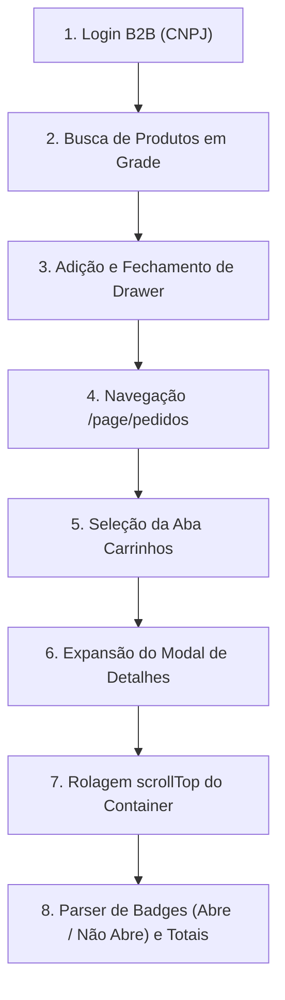

# 🔒 Mapeamento Oficial e Trava de Arquitetura — Cofema (Atacadista B2B)

> **Status:** LOCKED / TRAVADO & VALIDADO  
> **Data de Validação:** 17/09/2026  
> **Evidência de Validação:** Carrinho `#130620` (6 itens, R$ 286,91 — Batimento 100% Exato no DOM)  
> **Arquivo de Código Isolado:** `core/services/supplier-quote-engine/cofemaExtractor.js`

---

## 1. Diretriz de Isolamento & Regras da Trava

Este documento define o mapeamento oficial e a sequência de execução automatizada para o fornecedor **Cofema** na plataforma **Sara Cota**.

### **Regras da Trava:**
1. **Sequência de Passos Inalterável**: A lógica do fluxo (Login B2B → Busca Escopada na Grade → Adição → Navegação `/page/pedidos` → Aba Carrinhos → Expansão do Modal `Detalhes do Pedido` → Rolagem `scrollTop` do Container → Parser dos Cards de Produtos) é **definitiva e congelada**.
2. **Isolamento de Código**: Toda a lógica específica da Cofema está isolada em `cofemaExtractor.js`. Modificações ou novos desenvolvimentos nos demais fornecedores (**Cicalfer**, **Construjá**, **Megalast**) não podem impactar o módulo da Cofema.
3. **Exceção de Manutenção**: Apenas **seletores HTML** (classes CSS, IDs, atributos de elementos) podem ser atualizados no futuro caso o portal B2B da Cofema modifique seu layout.

---

## 2. Arquitetura do Fluxo de Execução Passos a Passos

### **Detalhamento dos Passos:**

#### **Passo 1: Login B2B na Área do Cliente**
- **URL Inicial:** `https://www.cofema.com.br/`
- **Acionamento:** Botão `Entre ou Cadastre-se` → Opção `Área do Cliente` do menu Radix Dialog.
- **Credenciais B2B:** 
  - Campo `#codigo`: CNPJ da empresa (`43.313.798/0001-34` recuperado dinamicamente de `fornecedores.login_salvo`).
  - Campo `#senha`: Senha descriptografada do Vault Supabase (`Santana5419`).
- **Submissão:** `button:has-text("Entrar")`.

#### **Passo 2: Busca Escopada na Grade Principal**
- **URL de Busca:** `https://www.cofema.com.br/page/busca?q={termo_normalizado}`
- **Escopamento DOM:** Captura de cartões de produtos restrita ao container `<main>` ou `<section>` de resultados de busca, evitando ler itens da gaveta lateral do carrinho.
- **Gaveta Lateral (Drawer):** Verificação e fechamento compulsório de qualquer elemento fixo/gaveta sobreposta (`#compra-rapida-carrinho`, `.offcanvas`) antes da leitura do cartão.

#### **Passo 3: Múltiplos de Venda e Adição**
- **Múltiplo de Venda:** Leitura do atributo `data-embalagem` / texto de embalagem fechada para ajustar a quantidade pedida ao múltiplo do fornecedor.
- **Adição:** Clique em `button:has-text("Adicionar")` relativo ao produto de maior score de similaridade/correlação semântica.

#### **Passo 4: Navegação e Acesso ao Carrinho Ativo**
- **Navegação:** Direcionamento explícito para `https://www.cofema.com.br/page/pedidos`.
- **Filtro de Aba:** Clique na aba `"Carrinhos"` (`Lista de Carrinhos (1)`).
- **Abertura do Modal:** Clique sobre a linha ou ícone de visualização do carrinho ativo (ex: `#130620`).

#### **Passo 5: Rolagem do Container e Parser de Badges**
- **Rolagem Crítica (`scrollTop = 2000`)**: O modal `Detalhes do Pedido` possui container rolável com altura fixa. A rolagem é **obrigatória** antes da leitura para renderizar itens abaixo da dobra (ex: itens 5 e 6).
- **Distinção de Badges:**
  - `Não Abre`: Embalagem master/rolo não fracionável (`1 un.`, `50M`).
  - `Abre`: Caixa/pack fracionável (ex: `5 un.`, `21 un.`, `6 un.`). Preço exibido é o total do pack.
- **Cálculo de Preço Unitário**: `precoUnitario = totalItem / (quantidadePedida * tamanhoEmbalagem)`.

---

## 3. Evidência de Batimento Auditável (#130620)

| Código (SKU) | Produto no DOM Real | Badge | Embalagem | Subtotal Real |
|---|---|---|---|---|
| `74179` | COND CORR.AM.TIGRE(C)3/4X50M 25MM | **Não Abre** | 50M | R\$ 99,95 |
| `250562` | ALICATE BOMBA DAGUA IRWIN 8" 13942 | **Abre** | 5 un. | R\$ 63,80 |
| `149853` | DUCHA LORENZ.MAXI-DUCHA 3T 127V 5500W | **Abre** | 21 un. | R\$ 74,72 |
| `410409` | OTTO B. BIANCO 900G SACHE | **Abre** | 6 un. | R\$ 24,57 |
| `418416` | RESIST TIPO BELLA DUCHA FASH.127V5500W | **Não Abre** | 1 un. | R\$ 12,89 |
| `401301` | RESIST TIPO BELLA DUCHA 127V5500W 451 | **Não Abre** | 1 un. | R\$ 10,99 |
| **TOTAL** | **6 Itens Extraídos** | — | — | **R\$ 286,91** |

---

## 4. Histórico de Alterações

- **17/09/2026**: Criação do documento, congelamento da arquitetura e isolamento do código em `cofemaExtractor.js`.
